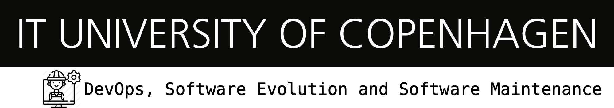

  

# Eagles: MiniTwit

IT University of Copenhagen 

**Trond Pingel Anchær Rossing <trro@itu.dk>** | **Jan Lishak <jlis@itu.dk>**  
**Rasmus Balder Nordbjærg <rano@itu.dk>** | **Daniel Spandet Grønbjerg <dangr@itu.dk>**  |
**Roman Zvoda <rozv@itu.dk>**

---

### Course Information:
**Name:** DevOps, Software Evolution and Software Maintenance, MSc (Spring 2024)  
**Code:** KSDSESM1KU  
**Description:** [https://learnit.itu.dk/local/coursebase/view.php?ciid=1391](https://learnit.itu.dk/local/coursebase/view.php?ciid=1391)  
**Teaching Staff:**  
**Helge Pfeiffer <ropf@itu.dk>**  
**Mircea Lungu <mlun@itu.dk>**

---

# Table of Contents

1. [Introduction](#introduction)
2. [System's Perspective](#System's-Perspective)
   1. [Design and Architecture](#design-and-architecture)
   2. [Dependencies](#dependencies)
   3. [Interactions of subsystems](#interactions)
   4. [State of the system](#State-of-the-system)
3. [Process' perspective](#Process'-perspective)
   1. [CI/CD](#CI-CD)
   2. [Monitoring](#monitoring)
   3. [Security assesment](#security-assesment)
   4. [Scaling](#scaling)
4. [Lessons learned](#lessons-learned)
   1. [Biggest Issues](#Biggest-issues)
   2. [Reflections](#reflections)
5. [Conclusion](#conclusion)
6. [Appendix](#appendix)

---

## 1. Introduction

The project focuses on building and maintaining a mock version of Twitter called **MiniTwit** by applying various DevOps techniques such as automation, cloud deployment, scaling, maintainability, monitoring, testing, and others. The initial web application, which was outdated with the latest technologies and was not following any standard practices, was rewritten from the ground up and gradually equipped with automations and improvements so that it is able to process a high load of requests coming to the app.