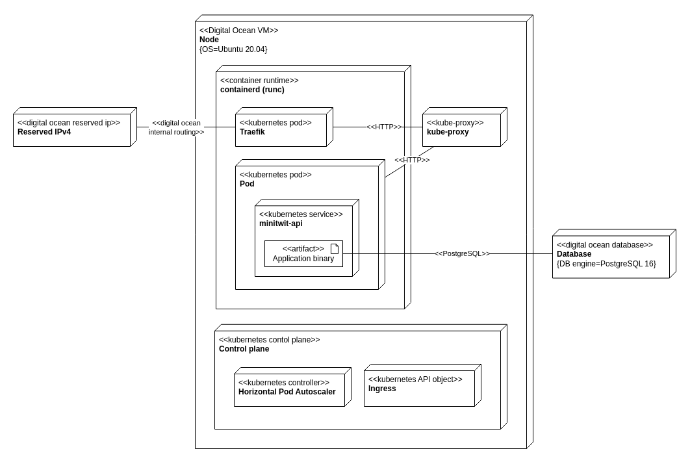
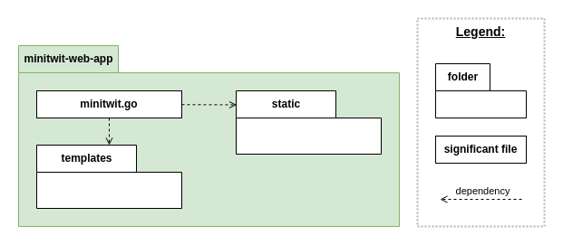
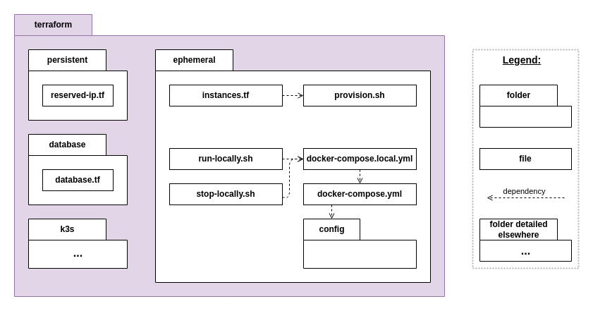

# System perspective

## Design and architecture

The documentation of the architecture differentiates between the old and the new architecture. The old architecture is deployed to a single Digital Ocean VM and spun up using docker compose. The new setup utilizes 2 digital ocean VMs hosting both worker nodes and the control plane.

### Old architecture

The below diagram shows the deployment diagram for the different components in the old architecture. At the end of the project this setup is still in use however the system is in process of being migrated to the new architecture explained later in the report.

The 2 main infrastructure components of the system are the the database and the server. The database is a managed PostgreSQL database from Digital Ocean. The server is Digital Ocean droplet sporting 1GB 25GB SSD storage.

Running on the server is docker compose which contains the following services:

- app - The minitwit web app
- api - The minitwit API used by the simulator
- watchtower - A service that updates the app and api to the  most recent container image
- prometheus - Scrapes the metric data exposed by the api
- promtail - Reads container logs from the host system
- loki - Receives logs pushed from promtail and indexes meta data
- grafana - The Grafana instance for displaying all logs and monitoring data. Pulls data from Loki and Prometheus.

\newpage
The flow of an incoming user request is fairly simple and looks something like this:  

### New architecture

Below diagram shows the new architecture hosted accross 2 Digital Ocean droplets, running Kubernetes:

The new architecture uses Traefik as a load balancer to route between 2..10 pods hosting the minitwit-api service. The ingress configuration defines the Traefik pod as the entry for incoming traffic. The Horizontal Pod Autoscaler (HPA) contains rules for when to increase/decrese the number of pods. The kube-proxy ensures routing between pods hosted in the cluster.

Generally the flow of a user request looks something like this:

The go [library used for session handling](https://github.com/gorilla/sessions/tree/main)
uses [securecookie](https://github.com/gorilla/securecookie)
for storing session data. This means that sessions data is encrypted at server-side but stored at client-side. This means that the session persists across pods as illustrated in below diagram:

## Repo structure

The diagrams in this section shows the repo structure in terms of files and folders. It is only showing files and folders that were deemed significant or interesting in understanding the repo.

Following is an overview of the top-level folders in the repo. The top-level folders are color coordinated which is also reflected in the following diagrams that dives deeper into each folder.

  

The *minitwit-api* folder contains go code that hosts the API.  

  

The *minitwit-web-app* contains go code for the web application.

The *terraform* folder contains the project's terraform templates and the *bash* scripts to configure the VMs. The below diagram shows the folder mainly related to the old architecture which is why the *k3s* is not expanded.

  

The below diagram shows the *terraform* and the *Charts* folders which were related to the Kubernetes setup. The *terraform/k3s* folder contains the setup for the VMs (nodes) and the *Charts* folder contains the helm chart for the Minitwit service

