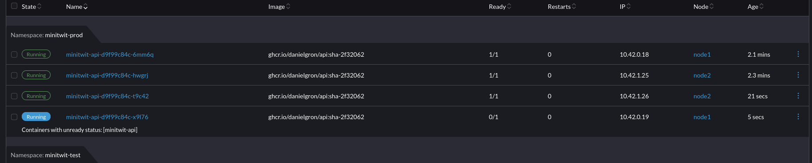

## Scaling and upgrades
When deployed on the Kubernetes cluster, the api will be deployed with 2 instances using blue/green deployment, which ensures no downtime when deploying.
It uses a very basic health check that requires the database connection to be established. The ingress will not point to the new instance until this check passes.

  

Once a container with the new image is up and running a coresponding pod based on the old image is terminated.

  

Autoscaling is enabled for the deployment, meaning that if load for a pod exceeds the treshold set, an extra pod is started.
Currently the main bottleneck is the database, meaning the application itself does not experience a load that actually instantiates new pods.

  

However by adding artificial stress on the cpu the autoscaling can be demonstrated:

  

  