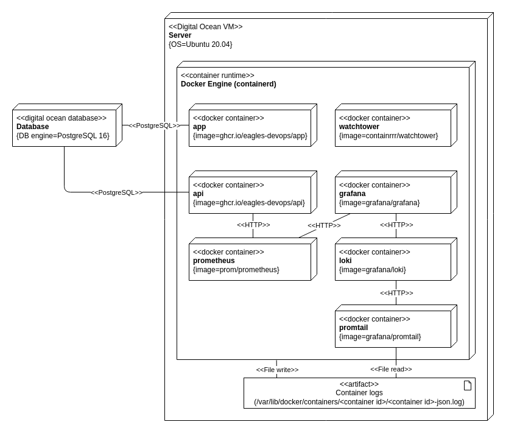
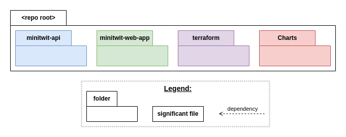

The documentation of the architecture differentiates between the old and the new architecture. The old architecture was

## Deployment views

### Old architecture

The below diagram shows the deployment diagram for the different components of an earlier design of the system. At the end of the project this setup was still in use however the system was in process of being migrated to the new architecture explained later in the report.

The 2 main parts of the system are the the database and the server. The database is a managed PostgreSQL  database from digital ocean. This was chosen for its

The components shown in the digram were all defined in a docker-compose file which was was to s

### New architecture
Below diagram shows the new architecture

## Old Setup

## New setup

The new architecture was

