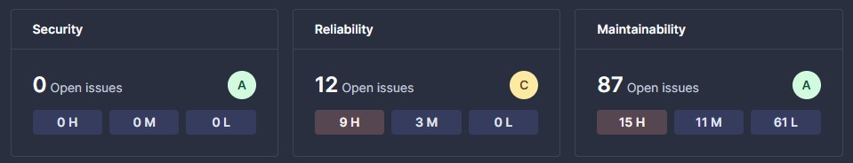

## State of the system

This section will break down the current state of the system looking through multiple components and their current status. Such approach allows us to provide sufficient report and locate which sections of the project require more work. Before, lets show some general data about the application to get an idea of the traffic. MiniTwit application has processed **14,5 million** request during its up-time with somewhere above 1 million of reported errors. This makes 6% error rate.

**1. Code Quality Analysis**  
SonarQube and CodeClimate were used to determine our code quality. Based on the last provided analysis from SonarQube our code seems to be secure with no security concerns. in terms of reliability, the code is proven to have a stable code base where most of the issues are related to other datetime variable interpretation than SonarQube is advising to use. Maintainability sections show the most issues with 87 recorded. Our code has a lot of error print statements which can be changed into constants. This would make the maintability part of the code much easier.  
To summarize; our code base would appreciate some minor adjustments but none of the aforementioned concerns create potential harm to the codes stablity and readability. 

  

**2. Dependency scan**  
The project utilizes 100 dependencies based on the dependency report made by Snyk where there are 3 dependencies currently vulnerable to SQl injection. GitHub dependency report shows only 63 dependencies reporting similar issue regarding SQL injection vulnerability in some of the dependencies. GitHubs *dependabot* created PR with needed update of the vulnerable dependencies which should resolve the issues when merged into main. 

**3. Security Analysis**  
Static code analysis already showed us code quality when it comes to security point of view. In this field our projects shows good score. The application does not expose any vulnerable secrets which can be used to access any parts of the system. Our vulnerable information such as login details, SSH keys and other information are stored either in GitHub secrets or we have an .env file which each member of the group store on their local machine. Sharing such sensitive information between developers is done via USB drive or sharing them through BitWarden. Moreoever, when potential problems occur, GitHubs Advanced Security bot will create an alert and block the open PR. 

**4. Test coverage**  
Application has different sets of test - end-to-end, simulator tests, API tests as well as linters. Even with these tests in place we do not achieve 100% code coverage and some errors may slip through. Before every merge into main we did manual tests as well to catch bugs or other errors by hand. This method is not suitable in the long run. In the future, projects would require some time into making more test cases as well as different focus test sets.

**5. Metrics, Logs and Dashboards**  
Application has monitoring running on Grafana utilizing Loki and Mimir as the data sources. Monitoring an application can be a huge project itself when done properly and in detail. Currently our application monitors the basic data which we were using to estimate the application performance. We can divide the data into 2 sections. First one is focus on more technical parameters which help the developers to asses the current errors or any other potential problems. Main monitored factors: failed requests, request duration, database read/writes. Second section are data related to business which can be easily understood by non-tech person. This includes number of users registered, amout of requests, number of messages and overall appliation status. 

Application and all of its functionalities work as expected also under higher load of upcomming requests to the server. Application uptime was satisfactory except one major outage happening from *25/03 01:30* till *28/03 20:30* caused by a memory issue error on the VM and was not spotted for few days. In a real life scenario such outage would be unacceptable and should trigger alerts and other security tools to inform the developers about downtime. 

#### AI chat bots
AI tools such as ChatGPT, Gemini, Opus-3 were used during the development stage. These tools were useful in many different cases. Usage helped us solve the errors much faster by providing us with clarity of the error messages. Another benefits such as code refactoring, topic explanation, and providing us with new approaches/tool to implement for the given problem. Usage of LLMs sped up the work and saved us a lot fo time. 

