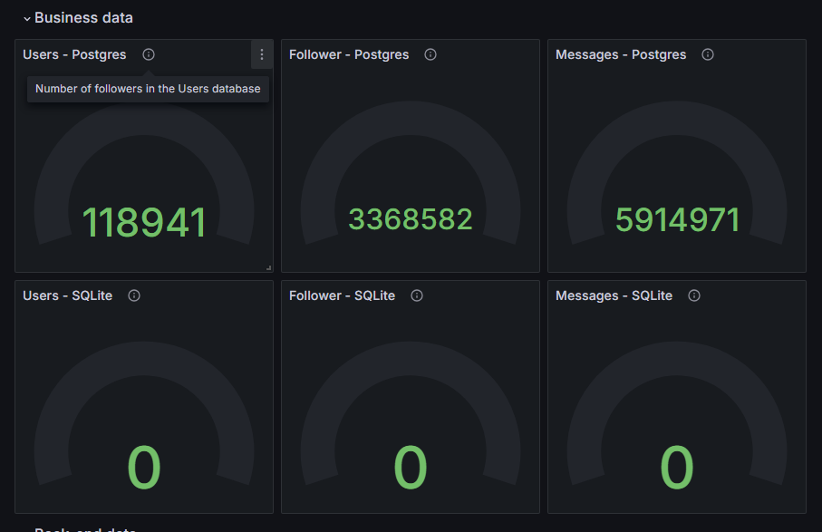

## Logging

## How do you monitor your systems and what precicely do you monitor?

For monitoring we use Prometheus with Grafana. We do so by incrementing gauges or vectors whenever an event has succesfully occured.
In the system we monitor a multitude of things, for business data we log:
    - We monitor the amount of users getting created.
    - The amount of new followers on the platform
    - Amount of new messages posted
    - The total amount of reads and writes made to the database between releases.
Besides incrementing counters we also monitor back-end data:
    - The amount of failed database read-writes
    - Whether there is a connection to the database
    - Succesful HTTP requests

Monitoring these gives us an insight to the extend of traffic passing through our API.
For ease of access to the monitored data and for visualization, the group uses Grafanas dashboards, see  //

## What do you log in your systems and how do you aggregate logs?

We log every error that happens during any database request. These are written through *zap*. The setup is such that the individual error logs are collected by logtail. Logtail then sends it to a Loki database that handles aggregation of the logs. The logs are visible through the Grafana Dashboard *Error Logs*.
We also log information logs when any request is made. These can be used to essentially trace all requests on the server.

It is important to note that we, due to time constraints, did not migrate our logs when moving to Kubernetes. The old logs and any new logs are hosted on the old production droplet.

