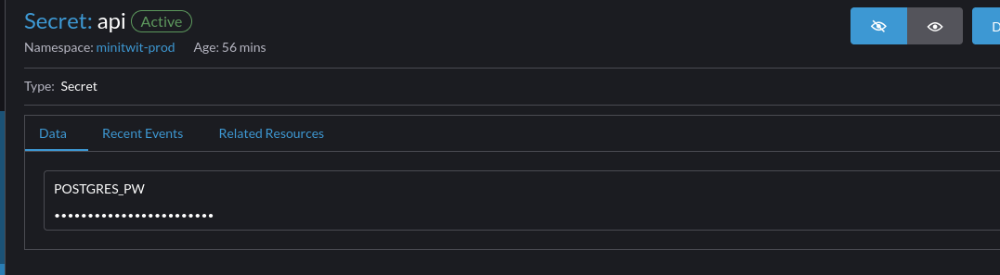
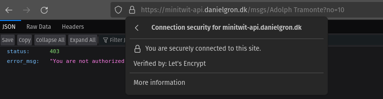

## K3S
The API is now running on a leightweight Kubernetes cluster - k3s. This cluster spans two Server nodes. 
The cluster is spun up from scratch using terraform, and the infrastructure takes about an hour to spin up, as it needs to wait for dns propagation to be able to confirm domain ownership for the SSL certificate.
Configuration and secrets are deployed in the cluster as part of the setup process.

When Kubernetes was chosen rather than an arguably easier option like docker swarm, it stems from Kubernetes being the industry standard.
Docker swarm is nice for showing simple scaling of containers, but Kubernetes seemed like an interesting challenge.
The complexity of Kubernetes has proven quite time consuming, and we didn't manage to move as many things as we would have liked to the cluster.

Rancher is running on top to provide a nice UI for management.

Letsencrypt is used for SSL certificates and is automatically created/renewed for deployments.

